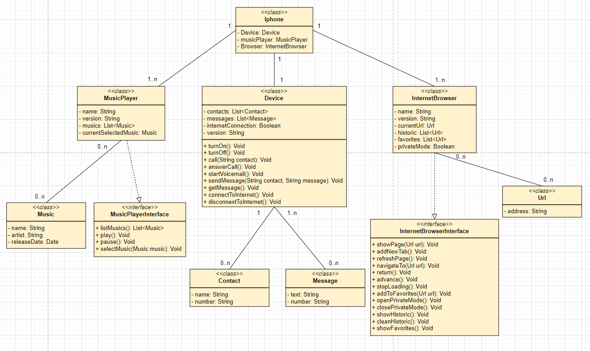

<h1 align="center">
 Modelagem e diagramação do Iphone
</h1>

	<b><i>
    Modelagem, diagramação em UML e Código dos componentes do iPhone. 
  </i></b>

<a href="./iphone.drawio">Arquivo .drawio do UML</a>  
<a href="./src">Componentes implementados</a>
